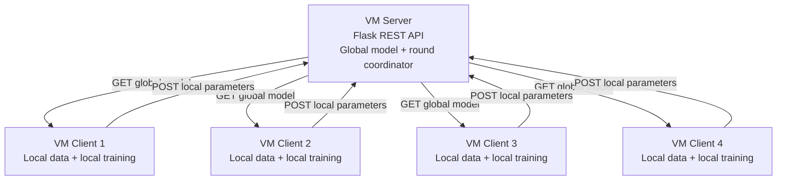
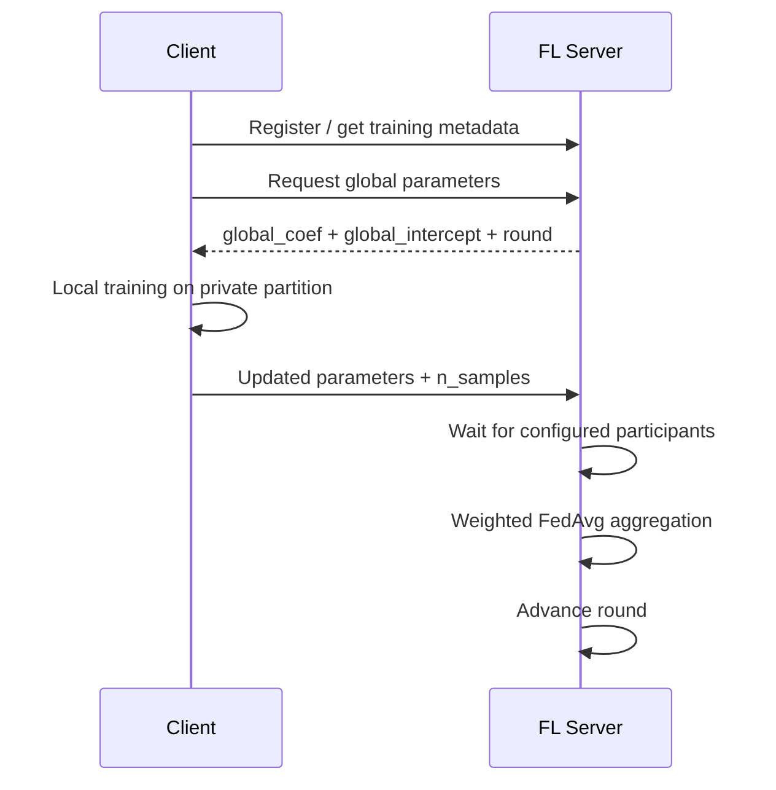

# Architecture

## Topology

The project uses a centralized Federated Learning coordinator with multiple distributed clients.



The original Group 1 project README describes the infrastructure as **1 VM server + 4 VM clients**.

## Server responsibilities

The coordinator is responsible for:

1. initializing the global Logistic Regression parameter shapes;
2. registering / tracking participating clients;
3. exposing the current global parameters;
4. receiving local client updates;
5. waiting for the configured client quorum for a round;
6. aggregating updates using FedAvg;
7. advancing the communication round;
8. exposing status / result information for evaluation.

The original source documents endpoints such as:

```text
GET  /api/model
POST /api/update
GET  /api/status
GET  /api/results
```

The final course report additionally describes an `/api/register` interaction used by clients to obtain training metadata.

## Client responsibilities

Each client:

1. loads its own local UCI HAR partition;
2. connects to the FL coordinator;
3. receives the global coefficient and intercept arrays;
4. injects those parameters into a local multinomial Logistic Regression model;
5. continues training locally with `warm_start=True`;
6. evaluates local training behavior;
7. serializes updated model parameters;
8. sends parameters and local sample count back to the server.

The raw local dataset does not need to be transferred as part of the FL update path.

## Data model

The HAR classifier contains:

- 561 input features;
- 6 target activity classes;
- a coefficient matrix for multinomial Logistic Regression;
- an intercept vector.

Both coefficient and intercept parameters must be aggregated consistently across clients.

## Round lifecycle



## Why the design matters

This architecture separates two concerns:

- **data locality**: training samples remain with each client;
- **model coordination**: the server aggregates parameter updates.

It is therefore a useful distributed-systems exercise even though it is not a production-scale FL framework.

## Failure / synchronization considerations

The report records practical distributed-system behavior such as clients waiting for the server round and a `round mismatch` condition when a client is not synchronized with the coordinator.

A production system would need stronger handling for:

- client dropouts;
- stale updates;
- stragglers;
- duplicate submissions;
- retries / idempotency;
- secure transport and client authentication;
- timeout policy;
- malicious or poisoned updates.

Those are documented as limitations rather than claimed as implemented features. See [LIMITATIONS.md](./LIMITATIONS.md).
