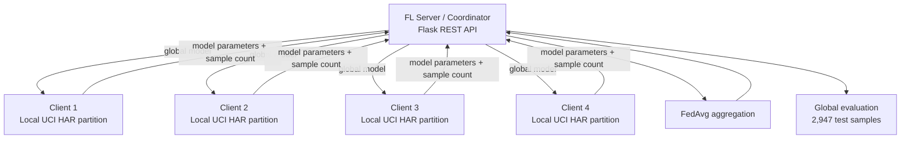
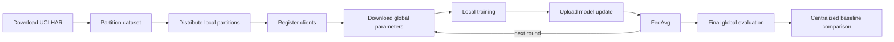

# Federated Learning for Mobile Activity Recognition

[](./ARCHITECTURE.md)
[](./FEDAVG.md)
[](./PRIVACY.md)
[](./RESULTS.md)

A portfolio case study of a **multi-node Federated Learning system for Human Activity Recognition (HAR)**. The project trains a global activity-classification model across distributed clients while keeping each client's raw training data local.

The experiment was completed as collaborative coursework for **Sistem Komputasi Terdistribusi** at Universitas Brawijaya in 2026. This personal repository is a curated, recruiter-facing presentation of the system design, experiments, evidence, and engineering lessons; it does **not** claim sole authorship of the original collaborative implementation.

## Why this project is interesting

The project is not only an ML classification exercise. It combines:

- distributed client/server coordination;
- REST-based model exchange;
- local model training;
- weighted Federated Averaging (FedAvg);
- IID vs Non-IID data distribution analysis;
- Differential Privacy experiments;
- convergence and communication-cost analysis;
- partial client participation;
- benchmarking against centralized ML.

That makes it useful as evidence for **distributed systems, ML engineering, privacy-aware systems, networking, and experimental analysis**.

## System at a glance



The original Group 1 source repository describes a **1-server + 4-client VM topology**. Each client trains a multinomial Logistic Regression model locally, then exchanges model parameters with the coordinator over HTTP rather than sending raw sensor data.

See [ARCHITECTURE.md](./ARCHITECTURE.md).

## Dataset

The experiment uses the **UCI Human Activity Recognition Using Smartphones** dataset:

- 7,352 training samples;
- 2,947 test samples;
- 561 time/frequency-domain features;
- smartphone accelerometer + gyroscope measurements;
- 6 activity classes:
  - WALKING
  - WALKING_UPSTAIRS
  - WALKING_DOWNSTAIRS
  - SITTING
  - STANDING
  - LAYING

## Main distributed run

The final course report records the following global evaluation after federated training:

| Metric | Global FL result |
|---|---:|
| Accuracy | **94.23%** |
| F1 macro | **0.9424** |
| F1 weighted | **0.9424** |
| Log loss | **0.1522** |
| Test samples | **2,947** |

The report compares the federated model with a centralized baseline of approximately **95.52% accuracy**, a gap of about **1.29 percentage points** in that evaluation run.


See [RESULTS.md](./RESULTS.md).

## FedAvg

The global model is constructed with weighted Federated Averaging:

```text
w_global = sum((n_k / N) * w_k)
```

where:

- `n_k` = local sample count for client `k`;
- `N` = total samples across participating clients;
- `w_k` = client model parameters.

One validation scenario used unequal client sizes and produced contribution weights of approximately:

| Client | FedAvg weight |
|---|---:|
| Client 1 | 0.2264 |
| Client 2 | 0.3396 |
| Client 3 | 0.1698 |
| Client 4 | 0.2641 |

The original implementation also included tests for balanced weighting, unequal weighting, single-client aggregation, shape consistency, and invalid input handling.

See [FEDAVG.md](./FEDAVG.md).

## IID vs Non-IID

A dedicated experiment studied how heterogeneous client data affects FL.

The Group 1 analysis reports:

| Metric | IID | Non-IID (`alpha=0.5`) |
|---|---:|---:|
| Round 1 accuracy | 94.10% | 88.77% |
| Round 5 accuracy | 94.60% | 92.60% |
| Round 10 accuracy | 94.71% | 93.21% |
| Final accuracy (Round 15) | **94.71%** | **93.45%** |
| Mean EMD | 0.0094 | 0.3116 |

The experiment demonstrates **client drift**: when clients observe different label distributions, local updates become less aligned and FedAvg converges less cleanly.


See [docs/IID_NONIID.md](./docs/IID_NONIID.md).

## Differential Privacy

The project also explored Gaussian-noise Differential Privacy. The course report demonstrates the central trade-off: tighter privacy budgets introduce stronger noise and can severely reduce utility for this high-dimensional HAR task.


The repository deliberately treats the DP exercise as an **experiment**, not proof that the final system provides production-grade privacy. Federated Learning alone also does not guarantee privacy against model-update leakage.

See [PRIVACY.md](./PRIVACY.md).

## Convergence and communication

The experiments also varied:

- local epochs (`E`);
- client participation fraction;
- communication rounds;
- approximate communication cost.

In the Group 1 convergence analysis, increasing local epochs did not improve final accuracy enough to justify the added compute time, while partial client participation exposed a trade-off between communication cost and stability.


See [docs/CONVERGENCE_COMMUNICATION.md](./docs/CONVERGENCE_COMMUNICATION.md).

## Engineering workflow



## Repository navigation

| Area | Document |
|---|---|
| Distributed architecture | [ARCHITECTURE.md](./ARCHITECTURE.md) |
| FedAvg implementation logic | [FEDAVG.md](./FEDAVG.md) |
| Experiments overview | [EXPERIMENTS.md](./EXPERIMENTS.md) |
| Privacy analysis | [PRIVACY.md](./PRIVACY.md) |
| Results and interpretation | [RESULTS.md](./RESULTS.md) |
| IID vs Non-IID | [docs/IID_NONIID.md](./docs/IID_NONIID.md) |
| Convergence / communication | [docs/CONVERGENCE_COMMUNICATION.md](./docs/CONVERGENCE_COMMUNICATION.md) |
| Testing / validation | [TESTING.md](./TESTING.md) |
| Limitations / non-claims | [LIMITATIONS.md](./LIMITATIONS.md) |
| Original source evidence | [SOURCE_EVIDENCE.md](./SOURCE_EVIDENCE.md) |
| Collaboration / attribution | [TEAM_ATTRIBUTION.md](./TEAM_ATTRIBUTION.md) |
| CV / recruiter summary | [PORTFOLIO.md](./PORTFOLIO.md) |

## Original collaborative source

The class report links the original implementation repositories for all four participating groups. The Group 1 repository includes the server, client, dataset utilities, evaluation scripts, and all four challenge directories:

- https://github.com/AmosJuang/FL-Mobile-Kelompok-1-

The complete source provenance is documented in [SOURCE_EVIDENCE.md](./SOURCE_EVIDENCE.md).

## Attribution

This was a **collaborative distributed-computing project**, not a solo repository. The course report covers work from four groups, and the original Group 1 repository preserves the implementation history. This personal repository focuses on making the engineering work understandable to recruiters without rewriting collaborative history.

See [TEAM_ATTRIBUTION.md](./TEAM_ATTRIBUTION.md).

## Security / privacy note

The public portfolio intentionally does not publish course-lab IP addresses, raw infrastructure identifiers, credentials, or private datasets. UCI HAR is a public research dataset; real user sensor data should require a substantially stronger privacy, consent, and security model.

---

**Portfolio owner:** [Syifani Adillah Salsabila](https://github.com/syifaniads)  
**Project type:** Collaborative Distributed Systems / Federated Learning coursework  
**Context:** Universitas Brawijaya - 2026
