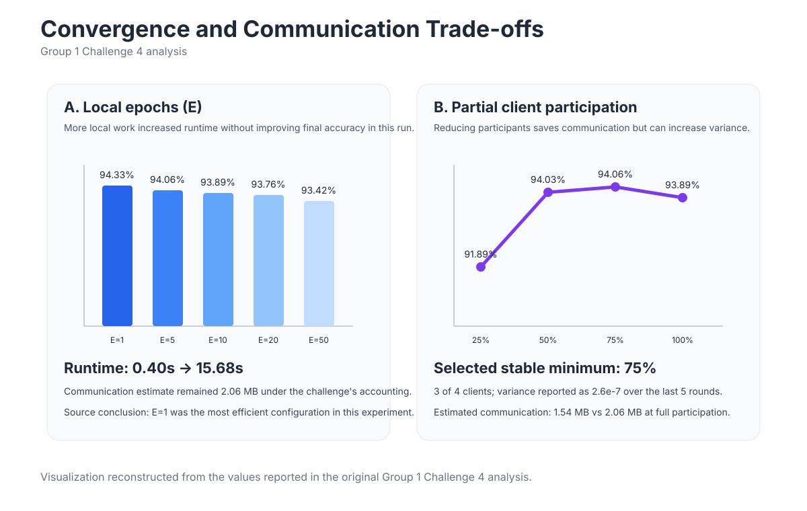

# Convergence and Communication Efficiency

Federated Learning shifts some computation to clients but introduces repeated network exchange. The project therefore analyzes both **local compute** and **communication participation**.

## Local epoch experiment

The Group 1 Challenge 4 analysis varies local epochs:

```text
E = 1, 5, 10, 20, 50
```

Reported result:

| E | Final accuracy | Total time | Estimated communication |
|---:|---:|---:|---:|
| 1 | **0.9433** | **0.40 s** | 2.06 MB |
| 5 | 0.9406 | 1.98 s | 2.06 MB |
| 10 | 0.9389 | 3.38 s | 2.06 MB |
| 20 | 0.9376 | 6.30 s | 2.06 MB |
| 50 | 0.9342 | 15.68 s | 2.06 MB |

For this experiment, more local epochs increase compute time without producing a better final model.

## Why this trade-off exists

More local training can reduce the number of server interactions needed in some FL settings, but it can also:

- increase client compute / energy usage;
- amplify local overfitting;
- increase drift when client data is heterogeneous;
- make straggler clients slower.

The optimal `E` therefore depends on the workload and data distribution.

## Partial participation

The challenge also varies the participating-client fraction:

```text
fraction = 0.25, 0.50, 0.75, 1.00
```

Reported result:

| Fraction | Clients / round | Final accuracy | Variance (last 5 rounds) | Estimated communication |
|---:|---:|---:|---:|---:|
| 0.25 | 1 | 0.9189 | 0.00005446 | 0.51 MB |
| 0.50 | 2 | 0.9403 | 0.00000952 | 1.03 MB |
| 0.75 | 3 | **0.9406** | **0.00000026** | 1.54 MB |
| 1.00 | 4 | 0.9389 | 0.00000085 | 2.06 MB |

The source analysis selects **0.75 participation** as the lowest stable fraction in that specific run.



## Main-run communication observation

The class discussion records approximately **34 seconds** for 10 rounds in one 4-client LAN run, with round durations around `2.7-4.5` seconds.

The report also observes that the model is already near its converged region before the final round. In principle, an early-stopping rule can avoid parameter exchanges that provide little utility.

## Production implications

A larger real-world FL system would need to reason about:

- network bandwidth;
- client availability;
- mobile energy consumption;
- stragglers;
- random / biased client sampling;
- compressed or quantized updates;
- asynchronous FL;
- minimum quorum and timeouts.

The coursework demonstrates the core trade-off, but does not claim those production optimizations were implemented.
