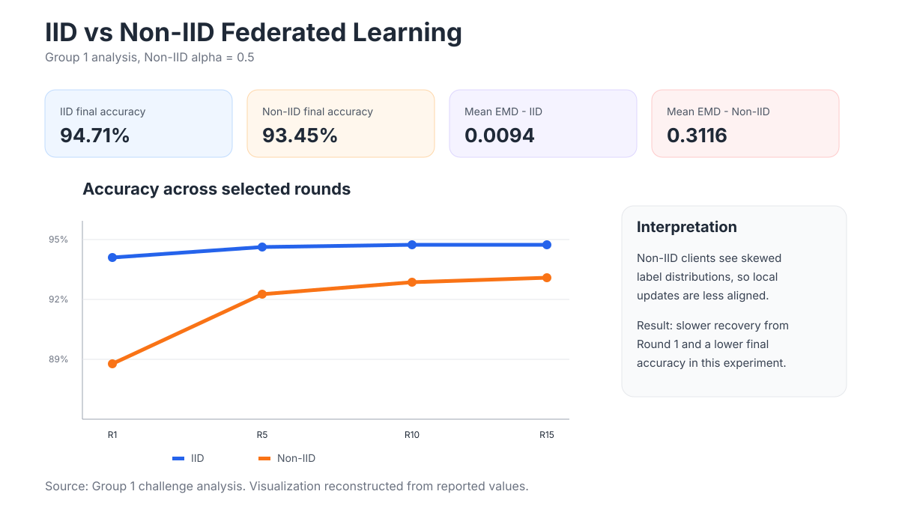

# IID vs Non-IID Client Data

## Why this matters

Federated Learning rarely operates over perfectly identical client data. Different users, devices, locations, or behaviors create **statistical heterogeneity**.

This project explicitly compares:

- **IID** partitions: each client sees a similar class distribution;
- **Non-IID** partitions: clients see skewed label distributions.

## Experimental setup

The Group 1 challenge analysis uses a Non-IID configuration with `alpha=0.5`.

It reports:

```text
Mean EMD - IID           : 0.0094
Mean EMD - Non-IID 0.5  : 0.3116
```

The higher Earth Mover's Distance indicates that client distributions are much less similar in the Non-IID case.

## Example skew

The source analysis describes distributions such as:

- Client 1 strongly dominated by LAYING;
- Client 2 strongly dominated by STANDING;
- Client 3 dominated by WALKING and SITTING;
- Client 4 dominated by WALKING_DOWNSTAIRS with additional LAYING.

This means different clients optimize against different local objectives.

## Client drift

Under IID data, local model updates tend to point toward similar optima.

Under Non-IID data, local updates can diverge because each client over-represents different classes. When the server averages these updates, part of one client's progress can be cancelled by another client's update.

This is commonly described as **client drift**.

## Project result

The original Group 1 analysis reports:

| Metric | IID | Non-IID (`alpha=0.5`) |
|---|---:|---:|
| Round 1 | 94.10% | 88.77% |
| Round 5 | 94.60% | 92.60% |
| Round 10 | 94.71% | 93.21% |
| Round 15 | **94.71%** | **93.45%** |



## Techniques discussed in the project analysis

The original challenge analysis discusses two approaches for stronger Non-IID settings:

### FedProx

FedProx adds a proximal term that discourages the local model from moving too far from the current global model.

Conceptually:

```text
local_objective + (mu / 2) * ||w_local - w_global||^2
```

### SCAFFOLD

SCAFFOLD uses control variates to correct local gradient drift and better align client updates with the global optimization direction.

These techniques were discussed as possible improvements; this portfolio does not claim they were integrated into the final FL server.

## Engineering takeaway

The important lesson is that FL scalability is not only about adding more clients. **Data heterogeneity changes the optimization problem itself**, so production FL needs algorithms and monitoring that understand client distribution differences.
